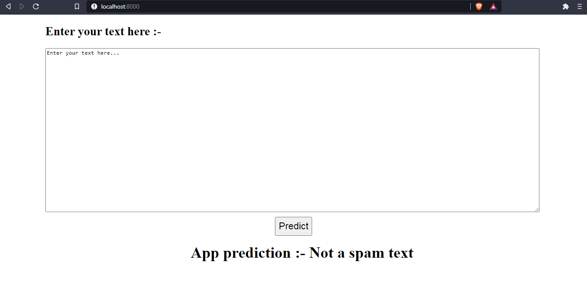

# spam-message-classifier
<h3>It is a small Natural Language Processing project to classify whether a text is spam or not spam.</h3>

Enter any text in text box and click on predict button.It will predict, given text is a spam or not.

  

 

If I enter the text, "Hii jatin, I will call you tomorrow" as it is not a spam text.So, it will predict not spam. 

  

  

 

Now If I enter the text, "FREE RINGTONE text FIRST to 87131 for a poly or text GET to 87131 for a true tone! Help? 0845 2814032 16 after 1st free, tones are 3x�150pw to e�nd txt stop" as it is not spam text.So, it will predict spam. 

  

  

